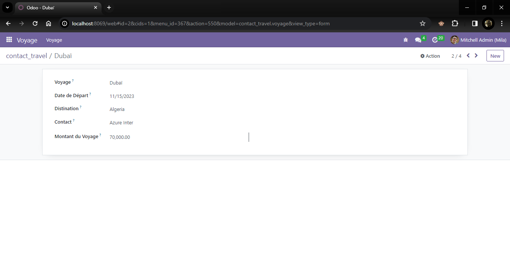
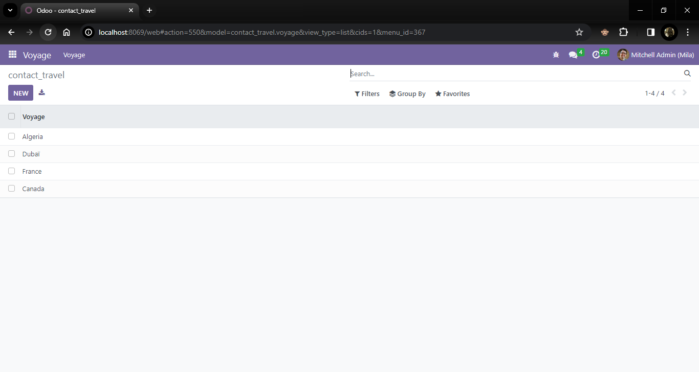
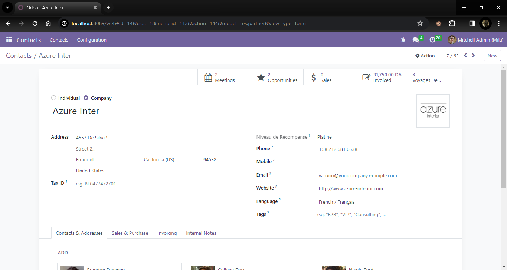

# test-travel-odoo

**Mon module Odoo "Contact_Travel"**

Le module "contact_travel" enrichit Odoo en fournissant des fonctionnalités avancées de gestion des voyages associés aux contacts. Les principales fonctionnalités incluent la possibilité de créer et de suivre des informations détaillées sur les voyages, telles que le nom, la date de départ, la destination, le contact associé et le montant du voyage.

L'héritage du modèle "res.partner" permet d'établir une relation étroite entre les contacts et leurs voyages respectifs. Chaque contact peut être associé à plusieurs voyages, offrant ainsi une vue complète de l'historique des voyages pour chaque contact.
 
Le module introduit également un mécanisme de calcul automatique du "Niveau de Récompense" pour chaque contact, basé sur le montant total des voyages réalisés. Ce niveau est mis à jour en temps réel pour refléter immédiatement le statut de récompense du contact en fonction de ses voyages récents.

 
**Description du formulaire de voyage**

La vue de formulaire pour le modéle "Voyage" de module "contacr_travel" représente l'interface utilisateur permettant de saisir et de visualiser les informations relatives aux voyages. Cette vue est conçue de manière intuitive pour garantir une expérience utilisateur fluide et efficace. Les champs inclus dans le formulaire captent des détails essentiels tels que le nom du voyage, la date de départ, la destination, le contact associé, et le montant du voyage. L'organisation logique des champs garantit une facilité d'utilisation, avec une mise en page claire et des regroupements cohérents.

La capture d'écran ci-dessus illustre visuellement la disposition des champs dans le formulaire de voyage. Elle offre un aperçu concret de l'interface utilisateur, permettant aux utilisateurs de saisir et de consulter rapidement les détails pertinents liés à chaque voyage.

**Description de la Tree View des Voyages Contacts**

La Tree view des voyages contacts offre une présentation organisée et concise de l'ensemble des voyages associés aux contacts. Chaque ligne représente un voyage et affiche clairement les informations essentiels tels que le nom du voyage, la date de départ, la destination, le contact associé et le montant du voyage. Cette disposition structurée facilite la gestion globale des voyages clients.

La capture d'écran ci-dessus illustre les voyages associés aux contacts.

**Description de la Vue Formulaire de Contact**

La vue formulaire du contact offre une interface conviviale pour gérer les informations relatives aux contacts. Elle intègre de manière transparente des fonctionnalités clés telles que le bouton "Voyages de l'Utilisateur" pour accéder rapidement à la liste des voyages associés à ce contact. Le champ "Nombre de Voyages" fournit instantanément le compte total des voyages liés à ce contact. De plus, le champ "Niveau de Récompense" est automatiquement calculé en fonction du montant cumulatif des voyages, affichant "Platine" pour un montant >= 100000, "Or" pour >= 50000, et "Argent" sinon. Cette automatisation simplifie la gestion des récompenses pour chaque contact.

La capture d'écran ci-dessus illustre la vue formulaire de contact.
   